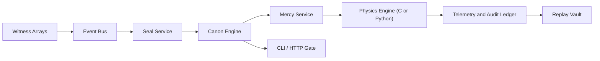

# Lumen Veil

```text
           L U M E N   V E I L
     ward lattice / canon engine / threshold custody
```

Lumen Veil es un archivo doctrinal de custodia perimetral interplanetaria para Sorox y Vossk. Reúne sensado, identidad, autorización, selección de canon, orquestación de campo, replay y auditoría dentro de un único monorepo modular. El resultado busca sentirse menos como un simulador genérico y más como un instrumento vivo de custodia: austero en naming, exacto en juicio y luminoso en estructura.

En su centro hay una idea simple. Un umbral no sólo se vigila. Se testimonia, se mide, se juzga y se mantiene en orden. Toda nave que cruza un corredor entra en un sistema que recuerda geometría, bearing, seal, permit, doctrina y consecuencia.

## Carácter

Lumen Veil está modelado por un lenguaje de ingeniería litúrgica:

- custodia antes que caos
- doctrina antes que improvisación
- contención antes que exceso
- replay antes que olvido
- transición de estado antes que resultado ambiguo

Ese carácter aparece tanto en el código como en la interfaz: `veil`, `canon`, `mercy`, `threshold`, `sanctuary`, `witness`, `containment`, `grace`, `shadow`, `release`.

## Canon of Restraint

Lumen Veil gobierna detección, juicio, aislamiento y contención reversible a través de umbrales interplanetarios. Su doctrina favorece continuidad, disciplina de corredor y transición de estado explicable por encima de la ruina. Por eso el sistema se construye alrededor de intervención acotada, escalamiento observable y custodia legible.

## Vista General

| Capa | Función | Implementación |
| --- | --- | --- |
| Witness | Recoger firmas remotas y patrón de aproximación | Servicios en Python |
| Seal | Evaluar identidad, permit, fidelidad de corredor y anomalía | Servicios en Python |
| Canon | Seleccionar la respuesta jurisdiccional mediante reglas ordenadas | Motor de políticas en Python |
| Mercy | Aplicar presión reversible sobre sistemas y transición de estado | Servicios en Python |
| Lattice | Propagar exposición de campo y degradación de subsistemas | Motor en C con fallback en Python |
| Ledger | Registrar eventos, telemetría, replay y auditoría | Servicios en Python |
| Gate | Exponer interfaces de comando y HTTP | CLI y API con librería estándar |

## Capacidades Principales

- Simulación abstracta de campo en C para movimiento, atenuación, exposición y presión sobre subsistemas.
- Wrapper estable en Python con fallback transparente cuando el módulo nativo no está disponible.
- Cánones jurisdiccionales para Sorox y Vossk, dirigidos por configuración declarativa.
- Arquitectura de servicios basada en eventos con streams replayables y contratos explícitos.
- Ciclo de vida de nave basado en máquina de estados, desde `observed` hasta `released`, `contained` o `exiled`.
- Biblioteca de escenarios con conflicto doctrinal, ruptura de corredor, paso de convoy, tormenta y disputa fronteriza.
- Telemetría estructurada, contadores, gauges, historial de transiciones y entradas de auditoría en cada ejecución.
- CLI y API HTTP aptas para simulación paso a paso, inspección de canon y reportes reproducibles.

## Primer Encuentro Recomendado

Construye la lattice, enumera los rites y luego conduce un pasaje:

```bash
python3 setup.py build_ext --inplace
PYTHONPATH=src python3 -m lumen_veil rites --pretty
PYTHONPATH=src python3 -m lumen_veil conduct \
  --scenario scenarios/sorox_unsealed_arrival.json \
  --steps 6 \
  --pretty
```

Si la compilación nativa no está disponible, el fallback de Python sigue ejecutando todo el archivo desde `PYTHONPATH=src`.

## Léxico de Comandos

Las formas ceremoniales son el rostro público de la interfaz:

- `rites`: enumerar pasajes y escenarios disponibles
- `conduct`: ejecutar un escenario completo desde el primer witness hasta el veredicto final
- `measure`: avanzar un escenario en incrementos deliberados
- `canon`: inspeccionar la doctrina de una jurisdicción
- `gate`: abrir la interfaz HTTP

Los aliases compatibles con el estilo anterior siguen disponibles:

- `list-scenarios`
- `run`
- `step`
- `inspect-policy`
- `serve`

## Ciclo de Custodia

Toda ejecución sigue el mismo orden:

1. Los witness arrays recogen firmas térmicas, de motor, de transpondedor y de aproximación.
2. El servicio Seal compara ruta, permit, geometría de corredor y bearing.
3. El motor Canon selecciona la regla gobernante para la jurisdicción actual.
4. La capa Mercy aplica presión acotada sobre comunicaciones, navegación, sensado, control o movimiento.
5. La lattice avanza exposición y estado de subsistemas bajo la influencia de los ward nodes.
6. El ledger registra eventos, telemetría, transiciones y explicación.

Ascenso típico:

```text
observed -> measured -> known -> blessed -> released
```

Rama de corrección:

```text
observed|measured|known -> shadowed -> degraded -> contained -> exiled
```

## Sorox y Vossk

Lumen Veil no se rige por una sola tabla genérica de políticas. Contiene dos temperamentos distintos.

### Sorox

Sorox trata la geometría del corredor como un asunto sagrado de orden. Cierra la ambigüedad con rapidez, concede grace de forma ceremonial y se mueve hacia containment sin vacilar cuando la santidad es cruzada.

Sorox tiende a:

- medir temprano
- negar con rapidez identidades débiles
- bendecir sólo el tránsito limpio
- contener la ruptura de sanctuaries sin demora

Ver [configs/jurisdictions/sorox.json](configs/jurisdictions/sorox.json).

### Vossk

Vossk es adaptable, guiado por patrón y más dispuesto a estudiar la conducta antes de sellar un veredicto. Bearing, drift, persistencia y fidelidad al corredor importan tanto como el título formal.

Vossk tiende a:

- tolerar durante más tiempo los acuerdos parciales
- proyectar shadow antes de cerrar
- degradar el desorden persistente
- reservar el cierre duro para intrusiones obstinadas o crecientes

Ver [configs/jurisdictions/vossk.json](configs/jurisdictions/vossk.json).

## Arquitectura

Lumen Veil se mueve en un orden simple: witness, seal, canon, mercy, ledger.



Responsabilidades en runtime:

- `physics/`: la lattice de movimiento, atenuación, exposición y presión sobre subsistemas.
- `src/lumen_veil/domain.py`: el lenguaje compartido para naves, thresholds, sanctuaries, wards y estados.
- `src/lumen_veil/policy.py`: el canon por el cual la doctrina se convierte en veredicto.
- `src/lumen_veil/services/`: los ministerios de witness, seal, juicio, containment, telemetría, replay y training.
- `configs/jurisdictions/`: la doctrina viva de Sorox y Vossk.
- `scenarios/`: pasajes escenificados donde la doctrina es probada bajo tensión.

## Vocabulario de Dominio

Las entidades principales incluyen:

- `Vessel`
- `TransitSeal`
- `TransitPermit`
- `WitnessArray`
- `WardNode`
- `TransitCorridor`
- `SanctuaryZone`
- `Threshold`
- `AegisState`
- `CanonRule`
- `CanonDecision`

Cada una existe para que el archivo siga siendo legible bajo replay. El código no oculta estado en efectos secundarios vagos cuando puede llevarlo como lenguaje de dominio explícito.

## Capa Física Nativa

El motor en C avanza posición, velocidad, exposición y degradación de subsistemas bajo la influencia de los ward nodes. Python envuelve el módulo nativo detrás de una interfaz estable de `PhysicsEngine`, de modo que el resto del archivo nunca dependa directamente de internals de CPython.

La capa nativa modela:

- movimiento 2D
- exposición acumulada
- presión de campo atenuada
- susceptibility y shielding
- degradación acotada de subsistemas

Está acompañada por un fallback de Python matemáticamente equivalente que se usa cuando la compilación nativa no está disponible.

Ver:

- [docs/physics.md](docs/physics.md)
- [physics/src/lumen_native.c](physics/src/lumen_native.c)
- [src/lumen_veil/physics.py](src/lumen_veil/physics.py)

## Biblioteca de Escenarios

Cada escenario es un rito de juicio con su propia textura doctrinal:

- `sorox_unsealed_arrival`: un casco sin seal entra en el gold path y recibe measure inmediato de Sorox.
- `vossk_minor_intrusion`: un contacto a la deriva pone a prueba la paciencia de Vossk ante un accord parcial.
- `authorized_convoy_anomaly`: un convoy bendecido continúa mientras una escolta cae en shadow.
- `low_mass_swarm`: contactos dispersos de baja masa obligan a Vossk a responder por patrón antes que por prisa.
- `false_flag_crossing`: un halo prestado cruza vigilancia ceremonial bajo un seal débil.
- `storm_degraded_sensor`: witness escaso en tormenta pone a prueba la contención de Vossk.
- `sorox_vossk_sovereignty_conflict`: grace extranjero entra en una frontera que reserva su propio juicio.
- `neutral_liturgical_corridor`: un rite-lane neutral permanece abierto sólo mientras geometría y bearing se mantengan en concordia.

Para listarlos directamente:

```bash
PYTHONPATH=src python3 -m lumen_veil rites --pretty
```

## Ejemplo de Conducta

Ejecuta un pasaje de Vossk:

```bash
PYTHONPATH=src python3 -m lumen_veil conduct \
  --scenario scenarios/vossk_minor_intrusion.json \
  --steps 8 \
  --pretty
```

El reporte incluye:

- `canon_name`
- `rite_summary`
- decisiones tick por tick
- entradas de auditoría
- stream de eventos
- snapshot de métricas
- resumen de replay
- estados finales

Ejecuta una medición paso a paso:

```bash
PYTHONPATH=src python3 -m lumen_veil measure \
  --scenario scenarios/authorized_convoy_anomaly.json \
  --steps 2 \
  --pretty
```

Inspecciona un canon:

```bash
PYTHONPATH=src python3 -m lumen_veil canon \
  --jurisdiction sorox \
  --pretty
```

Abre la gate HTTP:

```bash
PYTHONPATH=src python3 -m lumen_veil gate --host 127.0.0.1 --port 8787
```

## Estructura del Repositorio

```text
configs/        Cánones jurisdiccionales para Sorox y Vossk
docs/           Arquitectura, API, eventos, glosario y guías de desarrollo
examples/       Ejemplos reproducibles de uso
physics/        Motor nativo de propagación de campo
scenarios/      Fixtures narrativos de escenario
scripts/        Utilidades de desarrollo local
src/            Paquete Python y servicios
tests/          Tests unitarios, de integración, escenario, replay y propiedades
```

## Validación

El archivo se valida con tests unitarios, de integración, escenario, replay y propiedades:

```bash
python3 -m unittest discover -s tests -v
```

La suite cubre:

- geometría y comportamiento de transición de estado
- replay del event bus
- resultado de política a través de los escenarios incluidos
- monotonicidad del campo y efecto del shielding
- ejecución de la API HTTP

## Mapa de Documentación

- [docs/manifesto.md](docs/manifesto.md)
- [docs/architecture.md](docs/architecture.md)
- [docs/development.md](docs/development.md)
- [docs/scenarios.md](docs/scenarios.md)
- [docs/glossary.md](docs/glossary.md)
- [docs/api.md](docs/api.md)
- [docs/events.md](docs/events.md)
- [docs/policies.md](docs/policies.md)

## Nota de Cierre

Lumen Veil no está dispuesto como un prototipo descartable. Está dispuesto como un archivo de doctrina: algo que puede inspeccionarse, ensayarse, extenderse y habitarse. Cada módulo debería leerse como parte del mismo orden, y cada ejecución debería dejar tras de sí un ledger digno de juicio.
