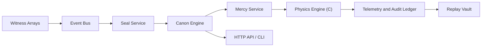

# Lumen Veil

```text
           L U M E N   V E I L
     ward lattice / canon engine / threshold custody
```

Lumen Veil is an interplanetary perimeter doctrine platform for Sorox and Vossk. It models sensing, identity, authorization, policy, field orchestration, containment, replay, and observability across sacred corridors, sanctuary zones, and contested borders.

The system is written as a modular monorepo:

- C provides the abstract field simulation core.
- Python provides orchestration, policy, services, CLI, API, tests, and scenario tooling.

## Canon of Restraint

Lumen Veil is a custodial system. It governs detection, judgment, isolation, and reversible containment across interplanetary thresholds. Its doctrine favors continuity, corridor discipline, and explainable state transition over ruin.

## Design Principles

- Sober naming with clear technical meaning.
- Declarative canon rules before imperative code paths.
- Full auditability of every transition and intervention.
- Separation between sensing, judgment, and response.
- Native acceleration for abstract field propagation, with a Python fallback.

## Command Lexicon

- `rites`: enumerate the bundled passages.
- `conduct`: run a full scenario from witness to verdict.
- `measure`: advance a scenario in deliberate increments.
- `canon`: inspect a jurisdictional doctrine.
- `gate`: open the HTTP interface.

## Repository Layout

```text
configs/        Jurisdiction canons for Sorox and Vossk
docs/           Architecture, API, events, glossary, development guides
examples/       Reproducible command examples
physics/        Native C field propagation engine
scenarios/      Narrative scenario fixtures
scripts/        Local development helpers
src/            Python package and services
tests/          Unit, integration, scenario, replay, and property-style tests
```

## Quick Start

```bash
python3 setup.py build_ext --inplace
PYTHONPATH=src python3 -m lumen_veil rites --pretty
PYTHONPATH=src python3 -m lumen_veil conduct --scenario scenarios/sorox_unsealed_arrival.json --steps 6 --pretty
```

If native compilation is unavailable, the Python fallback still runs the simulation from `PYTHONPATH=src`.

## Example CLI Flow

```bash
PYTHONPATH=src python3 -m lumen_veil conduct \
  --scenario scenarios/vossk_minor_intrusion.json \
  --steps 8 \
  --pretty
```

Example lifecycle:

1. Witness arrays detect thermal, engine, transponder, and behavior signatures.
2. The Seal service classifies the vessel under Sorox or Vossk doctrine.
3. The Canon engine selects a bounded response.
4. The Mercy service applies abstract communication, sensor, and navigation degradation.
5. The ledger records the transition from `observed` to `released`, `contained`, or `exiled`.

## Architecture



## Sorox and Vossk

- Sorox is hierarchical, sacred-corridor oriented, and swift to close ambiguity.
- Vossk is adaptive, behavior-led, and more tolerant of incomplete identity when bearing remains disciplined.

The doctrinal split lives in [`configs/jurisdictions/sorox.json`](/Volumes/macOS - Beck/SnoGuard/configs/jurisdictions/sorox.json) and [`configs/jurisdictions/vossk.json`](/Volumes/macOS - Beck/SnoGuard/configs/jurisdictions/vossk.json).

## Native Physics Layer

The C engine advances vessel position, velocity, exposure, and subsystem degradation under abstract ward-node influence. Python wraps the native module behind a stable `PhysicsEngine` interface, so the rest of the platform never depends on CPython internals.

See:

- [`docs/physics.md`](/Volumes/macOS - Beck/SnoGuard/docs/physics.md)
- [`physics/src/lumen_native.c`](/Volumes/macOS - Beck/SnoGuard/physics/src/lumen_native.c)

## Documentation

- [`docs/manifesto.md`](/Volumes/macOS - Beck/SnoGuard/docs/manifesto.md)
- [`docs/architecture.md`](/Volumes/macOS - Beck/SnoGuard/docs/architecture.md)
- [`docs/development.md`](/Volumes/macOS - Beck/SnoGuard/docs/development.md)
- [`docs/scenarios.md`](/Volumes/macOS - Beck/SnoGuard/docs/scenarios.md)
- [`docs/glossary.md`](/Volumes/macOS - Beck/SnoGuard/docs/glossary.md)
- [`docs/api.md`](/Volumes/macOS - Beck/SnoGuard/docs/api.md)
- [`docs/events.md`](/Volumes/macOS - Beck/SnoGuard/docs/events.md)
- [`docs/policies.md`](/Volumes/macOS - Beck/SnoGuard/docs/policies.md)

## Tests

```bash
python3 -m unittest discover -s tests -v
```

The test suite covers domain behavior, policy selection, scenario replay, field constraints, and API execution.
