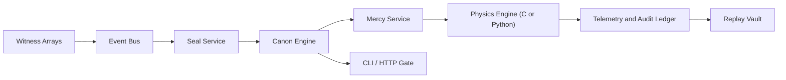

# Lumen Veil

```text
           L U M E N   V E I L
     ward lattice / canon engine / threshold custody
```

Lumen Veil is an interplanetary perimeter doctrine archive for Sorox and Vossk. It brings together sensing, identity, authorization, canon selection, field orchestration, replay, and audit within a single modular monorepo. The result is meant to feel less like a generic simulator and more like a living instrument of custody: austere in naming, exact in judgment, and luminous in structure.

At its center lies a simple idea. A threshold is not merely watched. It is witnessed, measured, judged, and held to order. Every vessel crossing a corridor enters a system that remembers geometry, bearing, seal, permit, doctrine, and consequence.

## Character

Lumen Veil is shaped by a liturgical engineering language:

- custody before chaos
- doctrine before improvisation
- restraint before excess
- replay before forgetting
- state transition before vague outcome

That character appears in both code and interface: `veil`, `canon`, `mercy`, `threshold`, `sanctuary`, `witness`, `containment`, `grace`, `shadow`, `release`.

## Canon of Restraint

Lumen Veil governs detection, judgment, isolation, and reversible containment across interplanetary thresholds. Its doctrine favors continuity, corridor discipline, and explainable state transition over ruin. The system is therefore built around bounded intervention, observable escalation, and legible custody.

## At a Glance

| Layer | Role | Implementation |
| --- | --- | --- |
| Witness | Collect remote signatures and approach pattern | Python services |
| Seal | Assess identity, permit, corridor fidelity, and anomaly | Python services |
| Canon | Select jurisdictional response through ordered rules | Python policy engine |
| Mercy | Apply reversible system pressure and state transition | Python services |
| Lattice | Propagate field exposure and subsystem degradation | C engine with Python fallback |
| Ledger | Record events, telemetry, replay, and audit | Python services |
| Gate | Expose command and HTTP interfaces | CLI and standard-library API |

## Principal Capabilities

- Abstract field simulation in C for motion, attenuation, exposure, and subsystem pressure.
- Stable Python wrapper with transparent fallback when the native module is unavailable.
- Jurisdictional canons for Sorox and Vossk, driven entirely by declarative configuration.
- Event-driven service architecture with replayable streams and explicit contracts.
- State-machine based vessel lifecycle from `observed` through `released`, `contained`, or `exiled`.
- Scenario library with doctrinal conflict, corridor breach, convoy passage, storm interference, and border dispute.
- Structured telemetry, counters, gauges, transition history, and audit entries for every run.
- CLI and HTTP interface suitable for stepwise simulation, canon inspection, and reproducible reports.

## Recommended First Encounter

Build the lattice, list the rites, then conduct one passage:

```bash
python3 setup.py build_ext --inplace
PYTHONPATH=src python3 -m lumen_veil rites --pretty
PYTHONPATH=src python3 -m lumen_veil conduct \
  --scenario scenarios/sorox_unsealed_arrival.json \
  --steps 6 \
  --pretty
```

If native compilation is unavailable, the Python fallback still runs the entire archive from `PYTHONPATH=src`.

## Command Lexicon

The ceremonial forms are the public face of the interface:

- `rites`: enumerate bundled passages and scenarios
- `conduct`: run a full scenario from first witness to final verdict
- `measure`: advance a scenario in deliberate increments
- `canon`: inspect a jurisdictional doctrine
- `gate`: open the HTTP interface

Backward-compatible aliases remain available:

- `list-scenarios`
- `run`
- `step`
- `inspect-policy`
- `serve`

## Passage Lifecycle

Every run follows the same order of custody:

1. Witness arrays collect thermal, engine, transponder, and approach signatures.
2. The Seal service compares route, permit, corridor geometry, and bearing.
3. The Canon engine selects the governing rule for the current jurisdiction.
4. The Mercy layer applies bounded pressure to communications, navigation, sensing, control, or motion.
5. The lattice advances exposure and subsystem state under ward-node influence.
6. The ledger records events, telemetry, transitions, and explanation.

Typical ascent:

```text
observed -> measured -> known -> blessed -> released
```

Correction branch:

```text
observed|measured|known -> shadowed -> degraded -> contained -> exiled
```

## Sorox and Vossk

Lumen Veil is not driven by one generic policy table. It carries two distinct temperaments.

### Sorox

Sorox treats corridor geometry as a sacred matter of order. It closes ambiguity quickly, grants grace ceremonially, and moves to containment without hesitation when sanctity is crossed.

Sorox tends to:

- measure early
- deny weak identity quickly
- bless only clean passage
- contain sanctuary breach without delay

See [`configs/jurisdictions/sorox.json`](/Volumes/macOS%20-%20Beck/SnoGuard/configs/jurisdictions/sorox.json).

### Vossk

Vossk is adaptive, pattern-led, and more willing to study conduct before it seals a verdict. Bearing, drift, persistence, and corridor fidelity matter as much as formal title.

Vossk tends to:

- tolerate partial accord longer
- shadow before it closes
- degrade persistent disorder
- reserve hard closure for stubborn or escalating intrusion

See [`configs/jurisdictions/vossk.json`](/Volumes/macOS%20-%20Beck/SnoGuard/configs/jurisdictions/vossk.json).

## Architecture

Lumen Veil moves in a simple order: witness, seal, canon, mercy, ledger.



Runtime responsibilities:

- `physics/`: the lattice of motion, attenuation, exposure, and subsystem pressure.
- `src/lumen_veil/domain.py`: shared language for vessels, thresholds, sanctuaries, wards, and state.
- `src/lumen_veil/policy.py`: the canon by which doctrine becomes verdict.
- `src/lumen_veil/services/`: the ministries of witness, seal, judgment, containment, telemetry, replay, and training.
- `configs/jurisdictions/`: living doctrine for Sorox and Vossk.
- `scenarios/`: staged passages where doctrine is tested under strain.

## Domain Vocabulary

Key entities include:

- `Vessel`
- `TransitSeal`
- `TransitPermit`
- `WitnessArray`
- `WardNode`
- `TransitCorridor`
- `SanctuaryZone`
- `Threshold`
- `AegisState`
- `CanonRule`
- `CanonDecision`

Each exists to make the archive legible under replay. The code never hides state in vague side effects when it can be carried as explicit domain language instead.

## Native Physics Layer

The C engine advances vessel position, velocity, exposure, and subsystem degradation under ward-node influence. Python wraps the native module behind a stable `PhysicsEngine` interface so the rest of the archive never depends directly on CPython internals.

The native layer models:

- 2D motion
- cumulative exposure
- attenuated field pressure
- susceptibility and shielding
- bounded subsystem degradation

It is paired with a mathematically equivalent Python fallback used whenever native compilation is absent.

See:

- [`docs/physics.md`](/Volumes/macOS%20-%20Beck/SnoGuard/docs/physics.md)
- [`physics/src/lumen_native.c`](/Volumes/macOS%20-%20Beck/SnoGuard/physics/src/lumen_native.c)
- [`src/lumen_veil/physics.py`](/Volumes/macOS%20-%20Beck/SnoGuard/src/lumen_veil/physics.py)

## Scenario Library

Each scenario is a rite of judgment with its own doctrinal texture:

- `sorox_unsealed_arrival`: an unsealed hull enters the gold path and meets immediate Sorox measure.
- `vossk_minor_intrusion`: a drifting contact tests Vossk's patience for partial accord.
- `authorized_convoy_anomaly`: a blessed convoy proceeds while one escort falls into shadow.
- `low_mass_swarm`: scattered low-mass contacts force Vossk to answer in pattern rather than haste.
- `false_flag_crossing`: a borrowed halo crosses ceremonial watch under a weak seal.
- `storm_degraded_sensor`: sparse witness in a storm tests Vossk restraint.
- `sorox_vossk_sovereignty_conflict`: foreign grace enters a border that reserves its own judgment.
- `neutral_liturgical_corridor`: a neutral rite-lane stays open only while geometry and bearing remain in concord.

To list them directly:

```bash
PYTHONPATH=src python3 -m lumen_veil rites --pretty
```

## Example Conduct

Run a Vossk passage:

```bash
PYTHONPATH=src python3 -m lumen_veil conduct \
  --scenario scenarios/vossk_minor_intrusion.json \
  --steps 8 \
  --pretty
```

The report includes:

- `canon_name`
- `rite_summary`
- tick-by-tick decisions
- audit entries
- event stream
- metrics snapshot
- replay summary
- final states

Run a stepwise measure:

```bash
PYTHONPATH=src python3 -m lumen_veil measure \
  --scenario scenarios/authorized_convoy_anomaly.json \
  --steps 2 \
  --pretty
```

Inspect a canon:

```bash
PYTHONPATH=src python3 -m lumen_veil canon \
  --jurisdiction sorox \
  --pretty
```

Open the HTTP gate:

```bash
PYTHONPATH=src python3 -m lumen_veil gate --host 127.0.0.1 --port 8787
```

## Repository Layout

```text
configs/        Jurisdiction canons for Sorox and Vossk
docs/           Architecture, API, events, glossary, development guides
examples/       Reproducible command examples
physics/        Native C field propagation engine
scenarios/      Narrative scenario fixtures
scripts/        Local development helpers
src/            Python package and services
tests/          Unit, integration, scenario, replay, and property-style tests
```

## Validation

The archive is validated through unit, integration, scenario, replay, and property-style tests:

```bash
python3 -m unittest discover -s tests -v
```

The suite covers:

- geometry and state transition behavior
- event bus replay
- policy outcome across bundled scenarios
- field monotonicity and shielding behavior
- HTTP API execution

## Documentation Map

- [`docs/manifesto.md`](/Volumes/macOS%20-%20Beck/SnoGuard/docs/manifesto.md)
- [`docs/architecture.md`](/Volumes/macOS%20-%20Beck/SnoGuard/docs/architecture.md)
- [`docs/development.md`](/Volumes/macOS%20-%20Beck/SnoGuard/docs/development.md)
- [`docs/scenarios.md`](/Volumes/macOS%20-%20Beck/SnoGuard/docs/scenarios.md)
- [`docs/glossary.md`](/Volumes/macOS%20-%20Beck/SnoGuard/docs/glossary.md)
- [`docs/api.md`](/Volumes/macOS%20-%20Beck/SnoGuard/docs/api.md)
- [`docs/events.md`](/Volumes/macOS%20-%20Beck/SnoGuard/docs/events.md)
- [`docs/policies.md`](/Volumes/macOS%20-%20Beck/SnoGuard/docs/policies.md)

## Closing Note

Lumen Veil is not arranged as a disposable prototype. It is arranged as an archive of doctrine: something to inspect, to rehearse, to extend, and to inhabit. Every module should read as part of the same order, and every run should leave behind a ledger worthy of judgment.
