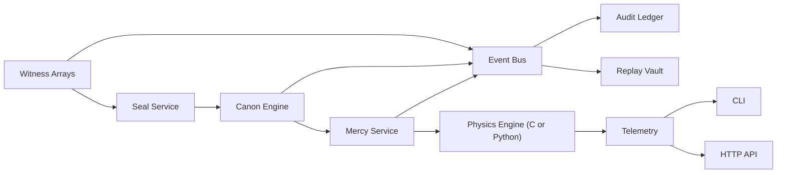

# Architecture

Lumen Veil moves in a simple order: witness, seal, canon, mercy, ledger. Each layer has one duty, and each duty remains visible to replay and judgment.

## Order of Custody

```text
Witness Arrays -> Seal Service -> Canon Engine -> Mercy Service -> Physics Engine
       |               |               |                |               |
       v               v               v                v               v
   Event Bus ----> Audit Ledger -> Telemetry -> Replay Vault -> CLI / HTTP API
```



## Core Layers

- `physics/`: the lattice of motion, attenuation, exposure, and subsystem pressure.
- `src/lumen_veil/domain.py`: the shared language of vessels, thresholds, sanctuaries, and state.
- `src/lumen_veil/policy.py`: the canon by which doctrine becomes decision.
- `src/lumen_veil/services/`: the ministries of witness, seal, judgment, containment, telemetry, replay, and training.
- `configs/jurisdictions/`: the living canons of Sorox and Vossk.
- `scenarios/`: the staged passages by which doctrine is tested under strain.

## State Machine

`observed -> measured -> known -> blessed -> released`

Correction branch:

`observed|measured|known -> shadowed -> degraded -> contained -> exiled`

Sorox will leap directly from `observed` to `contained` when sanctity is breached. Vossk more often proceeds through `shadowed` and `degraded`, preferring to read pattern before it closes the field.
